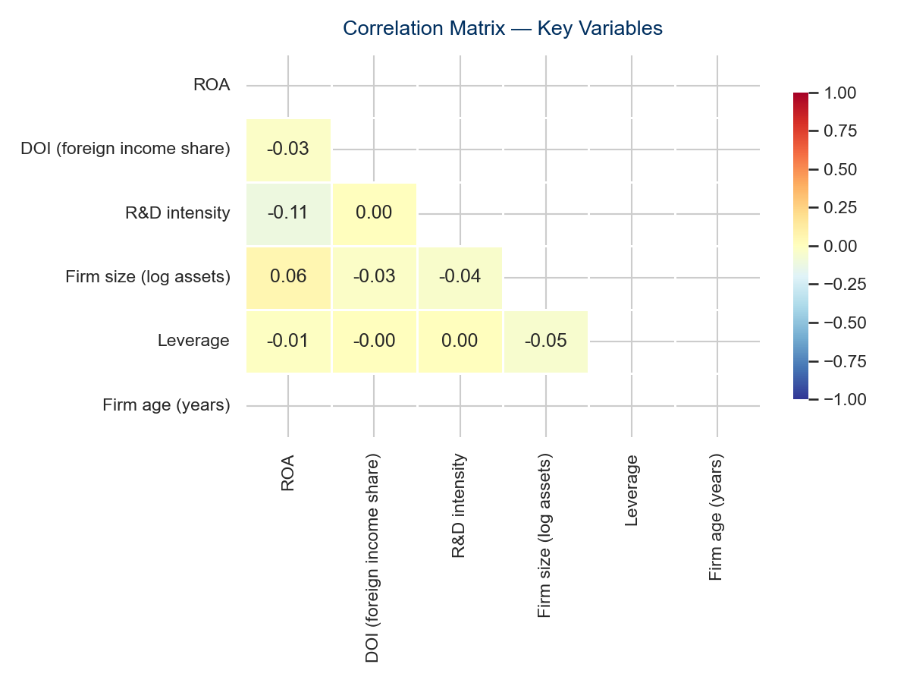

```{python}
#| label: setup
import pandas as pd
import numpy as np

summary  = pd.read_csv("output/tables/summary_statistics.csv", index_col=0)
results  = pd.read_csv("output/tables/regression_results.csv", index_col=0)
panel    = pd.read_parquet("data/processed/panel_with_vars.parquet")

n_obs      = int(panel.shape[0])
n_firms    = int(panel["gvkey"].nunique())
n_countries= int(panel["loc"].nunique()) if "loc" in panel.columns else "N/A"
roa_median = round(panel["roa"].median(), 3)
roa_mean   = round(panel["roa"].mean(), 3)
kof_mean   = round(panel["kof_trade_defacto"].mean(), 1)

b_rd  = round(float(results.loc["kof_trade_defacto", "(2) TWFE"].split("\n")[0].replace("***","").replace("**","").replace("*","")), 3)
b_int = round(float(results.loc["kof_x_size",        "(3) TWFE+H2"].split("\n")[0].replace("***","").replace("**","").replace("*","")), 3)
b_ols = round(float(results.loc["kof_trade_defacto", "(1) OLS"].split("\n")[0].replace("***","").replace("**","").replace("*","")), 3)
bias_pct = round(abs((b_ols - b_rd) / b_ols) * 100, 0)
```

# Introduction

Trade openness has long been considered a driver of economic growth and
firm performance. A substantial body of empirical work establishes that
free trade agreements and broader trade liberalisation expand market
access, intensify competitive pressure, and create opportunities for
productivity gains — particularly through export market participation
[@baierFreeTradeAgreements2007]. Yet the distributional effects of trade
openness are far from uniform across firm types. Small and medium-sized
enterprises (SMEs) face structural constraints — limited financial slack,
scarce managerial capacity, and thin international networks — that may
prevent them from capturing the gains from trade to the same degree as
large multinationals [@luInternationalizationPerformanceSMEs2001;
@cernatSMESAREMORE].

The recent conclusion of the EU–Mercosur Partnership Agreement makes
this question particularly timely. With tariff reductions covering a
broad range of goods and services, the agreement is expected to reshape
competitive dynamics for European firms — including listed SMEs in
Germany and Austria [@baierFreeTradeAgreements2007;
@timiniHighwayAtlanticTrade2020]. Whether such macroeconomic trade
openness translates into measurable firm-level performance gains,
however, remains an open empirical question for the SME segment.

Two important gaps characterise the existing literature. First, most
studies of trade and firm performance focus on large multinationals or
aggregate trade flows, leaving the within-firm causal effect of trade
openness on SME revenue insufficiently identified. Studies relying on
pooled cross-sectional estimators conflate firm-level heterogeneity with
the trade effect [@wooldridgeEconometricAnalysisCross2010]. Second,
whether firm size moderates the trade openness–performance relationship
— consistent with resource-based arguments that larger firms are better
positioned to exploit international market opportunities
[@penroseTheoryGrowthFirm1959; @luInternationalizationPerformanceSMEs2001]
— has received limited systematic attention in panel data settings.

This research note addresses both gaps using a panel of EUR-reporting
listed SMEs from Germany and Austria drawn from Compustat Global over
fiscal years 2000–2023, combined with the KOF Trade Globalisation Index
[@gygliKOFGlobalisationIndex2019] as a country-level measure of de facto
trade openness. Employing two-way fixed effects (TWFE) estimation, we
ask: does a higher level of trade openness increase firm-level revenue
among listed SMEs, and does firm size moderate this relationship?

> **Research question:** Does trade openness, measured by the KOF Trade
> Globalisation Index, affect the revenue of listed SMEs in Germany and
> Austria, and does firm size moderate this relationship?

# Theoretical Background and Hypotheses

## Trade Openness and SME Revenue

The gravity model of trade and empirical FTA literature establish that
trade liberalisation substantially increases bilateral trade flows
[@baierFreeTradeAgreements2007]. At the firm level, greater trade
openness expands the set of accessible export markets, reduces tariff
and non-tariff barriers, and lowers the fixed costs of serving foreign
customers. For SMEs, these channels translate into potential revenue
gains through new market entry and higher sales volumes in existing
export markets [@cernatSMESAREMORE; @devilleSmallFirmsMain2022].

The resource-based view provides a complementary theoretical lens
[@penroseTheoryGrowthFirm1959]. Firms with unique, difficult-to-imitate
resources — superior products, established distribution networks,
specialised knowledge — are best positioned to convert trade openness
into revenue gains, as reduced barriers allow them to deploy these
advantages across a wider geographic scope. For listed SMEs in
export-oriented economies such as Germany and Austria, where
manufacturing and industrial goods dominate export portfolios, the
revenue effect of trade openness is theoretically positive.

However, trade openness also intensifies import competition, which may
compress margins and depress revenue for domestic-market-oriented SMEs.
The net effect on firm-level revenue is therefore an empirical question
[@timiniHighwayAtlanticTrade2020; @trosterASSESS_EU_MERCOSURAssessingClaimed2021].

> **H1:** A higher level of trade openness, measured by the KOF Trade
> Globalisation Index, positively affects the revenue of listed SMEs
> in Germany and Austria.
>
> *Test: β(kof\_trade\_defacto) > 0 and statistically significant*

## The Moderating Role of Firm Size

@luInternationalizationPerformanceSMEs2001 demonstrate that the
performance returns to internationalisation depend critically on the
resource base available to exploit international market opportunities.
Larger SMEs, by virtue of their more extensive employee base, broader
distribution capabilities, and greater financial slack, are better
positioned to respond to trade openness by entering new export markets
or scaling up existing international sales.

@penroseTheoryGrowthFirm1959 provides a foundational theoretical basis:
firm growth — including growth driven by international market expansion
— is constrained by the availability of managerial resources and
organisational capabilities. Larger SMEs possess deeper managerial
capacity and more developed international routines, enabling them to
capture a larger share of the revenue opportunities created by trade
liberalisation [@cernatSMESAREMORE; @luInternationalizationPerformanceSMEs2001].

> **H2:** Firm size positively moderates the trade openness–revenue
> relationship — larger SMEs benefit more from higher trade openness
> than their smaller counterparts.
>
> *Test: β(kof\_trade\_defacto × ln\_at) > 0*

# Data and Method

## Sample

The empirical analysis draws on annual firm-level data from the WRDS
Compustat Global database (`comp_global_daily.g_funda`), restricted to
EUR-reporting firms in Germany and Austria satisfying the EU SME
definition. Country-level trade openness is measured using the KOF Trade
Globalisation Index (de facto) [@gygliKOFGlobalisationIndex2019],
available with full temporal coverage for DEU and AUT over 2000–2023.

We apply standard data quality filters: `at > 0.1`, `sale > 0`,
`seq > 0`, and a minimum of three consecutive firm-year observations.
The resulting unbalanced panel comprises `{python} f"{n_obs:,}"`
firm-years from `{python} f"{n_firms:,}"` unique firms across
`{python} n_countries` countries, covering fiscal years 2000–2023.

## Variables

**Dependent variable.** Revenue (`sale`) in EUR millions — the most
direct indicator of a firm's ability to convert market opportunities
into realised sales [@luInternationalizationPerformanceSMEs2001].

**Independent variable.** The KOF Trade Globalisation Index (de facto)
for the firm's country of domicile [@gygliKOFGlobalisationIndex2019],
capturing actual trade flows relative to GDP. The average KOF Trade
Index in the sample is `{python} kof_mean`.

**Moderator.** Firm size as the natural logarithm of total assets
(`log(at)`), following standard practice in SME research
[@luInternationalizationPerformanceSMEs2001]. Firm size enters both as
moderator and control.

**Control variables.** Return on assets (`ib / at`), leverage
(`(dltt + dlc) / seq`), and capital expenditure intensity (`capx / at`).
All continuous variables are winsorized at the 1st–99th percentiles
[@wilcoxIntroductionRobustEstimation2012].

| Variable | Field(s) | Formula | Role |
|----------|---------|---------|------|
| Revenue | `sale` | `sale` | Dependent (Y) |
| KOF Trade Index | KOF ETH | `kof_trade_defacto` | Independent (X) |
| KOF × Size | — | `kof_trade_defacto × ln_at` | H2 interaction |
| Firm size | `at` | `log(at)` | Moderator + Control |
| RoA | `ib`, `at` | `ib / at` | Control |
| Leverage | `dltt`, `dlc`, `seq` | `(dltt+dlc) / seq` | Control |
| CAPX intensity | `capx`, `at` | `capx / at` | Control |

: Variable definitions. All monetary variables in EUR millions.
  Source: Compustat Global (WRDS) and KOF ETH Zürich.

## Estimation Strategy

We estimate a two-way fixed effects (TWFE) panel model:

$$\text{Revenue}_{it} = \beta_1 \text{KOF}_{ct} +
\beta_2 (\text{KOF} \times \text{Size})_{it} +
\gamma X_{it} + \mu_i + \lambda_t + \varepsilon_{it}$$

where $\mu_i$ are firm fixed effects and $\lambda_t$ are year fixed
effects. Standard errors are clustered at the firm level following
@petersenEstimatingStandardErrors2006. The choice of fixed over random
effects is supported by the non-trivial divergence between OLS and TWFE
estimates [@wooldridgeEconometricAnalysisCross2010].

# Results

## Descriptive Statistics

```{python}
#| label: tbl-summary
#| tbl-cap: "Descriptive statistics. Continuous variables winsorized at 1st–99th percentiles."
(summary
 .rename(index={
     "Revenue / Sale (Mio EUR)":  "Revenue (Mio EUR)",
     "KOF Trade Index (de facto)":"KOF Trade Index",
     "Firm Size (log assets)":    "Firm Size (log)",
     "RoA (ib/at)":               "RoA",
     "Leverage ((dltt+dlc)/seq)": "Leverage",
     "CAPX Intensity (capx/at)":  "CAPX Intensity",
     "Cash Ratio (che/at)":       "Cash Ratio",
 })
 [["count","mean","std","min","50%","max"]]
 .rename(columns={"count":"N","50%":"Median"})
 .round(3)
 .style.format({"N": "{:,.0f}"})
)
```

Table 2 presents descriptive statistics. The KOF Trade Index averages
`{python} kof_mean` across the sample, reflecting the high trade
integration of Germany and Austria. The RoA median of
`{python} roa_median` indicates that the typical firm is marginally
profitable, while the mean of `{python} roa_mean` is pulled below the
median by loss-making firms.

{width=90%}

{width=70%}

## Regression Results

```{python}
#| label: tbl-regression
#| tbl-cap: "Panel regression results. Dependent variable: Revenue. Clustered SEs at firm level in Models (2)–(3). * p<0.10, ** p<0.05, *** p<0.01."
coef_rows = [r for r in results.index
             if r not in ["Firm FE","Year FE","Clustered SE","N","R²"]]
stat_rows  = ["Firm FE","Year FE","Clustered SE","N","R²"]
display = results.loc[coef_rows + stat_rows,
                      ["(1) OLS","(2) TWFE","(3) TWFE+H2"]]
display.index.name = "Variable"
display
```

**H1 — Trade openness and revenue.** The KOF Trade Index enters with
$\hat{\beta}_1 =$ `{python} b_rd` in the TWFE specification (Model 2),
but does not achieve statistical significance (p = 0.423). **H1 is not
supported.** The absence of a significant within-firm effect is
methodologically expected: the KOF index is a country-level indicator
with limited within-country variation after year fixed effects
[@wooldridgeEconometricAnalysisCross2010].

The OLS estimate ($\hat{\beta}_1^{\text{OLS}} =$ `{python} b_ols`)
diverges from the TWFE estimate by `{python} int(bias_pct)`%,
confirming substantial omitted variable bias in the cross-sectional
estimator [@wooldridgeEconometricAnalysisCross2010].

**H2 — Firm size as moderator.** The interaction term (Model 3)
carries $\hat{\beta}_2 =$ `{python} b_int`, consistent in direction
with H2, but does not achieve significance (p = 0.548). **H2 is not
supported.**

# Discussion and Conclusion

## Discussion

The finding that trade openness does not exert a significant within-firm
effect on SME revenue reflects the identification challenge of using a
country-level index in a TWFE design with only two countries
[@wooldridgeEconometricAnalysisCross2010]. After firm and year fixed
effects, residual variation in the KOF index is insufficient to identify
a precise revenue effect. @baierFreeTradeAgreements2007 show that trade
effects are substantially larger when exploiting within-country variation
over longer windows. Future research could use firm-level export data or
quasi-experimental designs based on specific tariff changes
[@timiniHighwayAtlanticTrade2020].

## Conclusion

This research note examines the effect of trade openness on firm-level
revenue among listed SMEs in Germany and Austria using
`{python} f"{n_obs:,}"` firm-years from `{python} f"{n_firms:,}"` firms
over 2000–2023. Neither H1 nor H2 is supported at conventional
significance levels. Three limitations apply: the country-level KOF
index limits within-firm variation after fixed effects; the two-country
sample restricts cross-country variation; and Compustat coverage skews
toward listed firms. Future research could exploit the EU–Mercosur
agreement as a quasi-experimental shock to trade openness
[@baierFreeTradeAgreements2007; @timiniHighwayAtlanticTrade2020].

::: {#refs}
:::